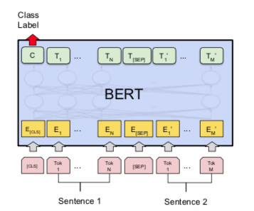

# PyTorch Implementation of BERT based Response Selection
### 1. Preparing package/dataset

0.  `pip install -r requirements.txt` 를 이용하여 필요한 패키지를 설치해주세요
1. Ubuntu Dialog Corpus V2 를 다운로드하시고 `./rsc/data/` 경로로 압축 해제해주세요.
2. `sh run_main.sh` 를 이용하여 실행합니다.

### 2. Model Overview

BERT 를 이용한 미세조정(Fine-tuning) 을 할 때, 대표적으로 위의 그림처럼 입력 값을 넣을 수 있습니다. 이 때, 입력 값의 Sentence 1 에는 대화 맥락 (Ubuntu Dialog Corpus - Context), Sentence 2 에는 응답문 (Ubuntu Dialog Corpus - Utterance) 로 구성합니다.

이렇게 하면 결과적으로 **`Next Utterance Prediction`** 을 수행할 수 있게 됩니다.

### 3. Implementation Overview

- [hugging face - Transformers](https://github.com/huggingface/transformers) 를 이용하였습니다.
- PyTorch 1.5 를 기준으로 하였습니다.

### 4. Reference

`
@misc{devlin2018bert,
    title={BERT: Pre-training of Deep Bidirectional Transformers for Language Understanding},
    author={Jacob Devlin and Ming-Wei Chang and Kenton Lee and Kristina Toutanova},
    year={2018},
    eprint={1810.04805},
    archivePrefix={arXiv},
    primaryClass={cs.CL}
}
`

